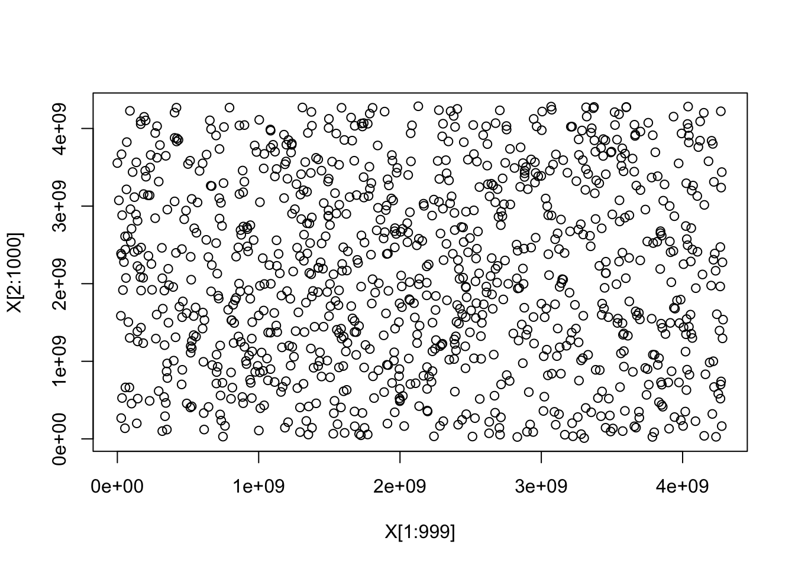
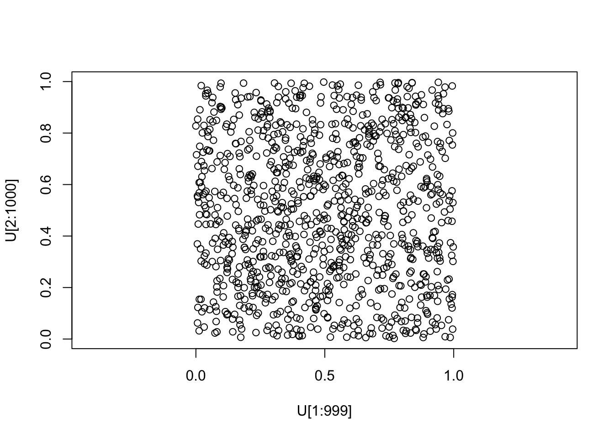
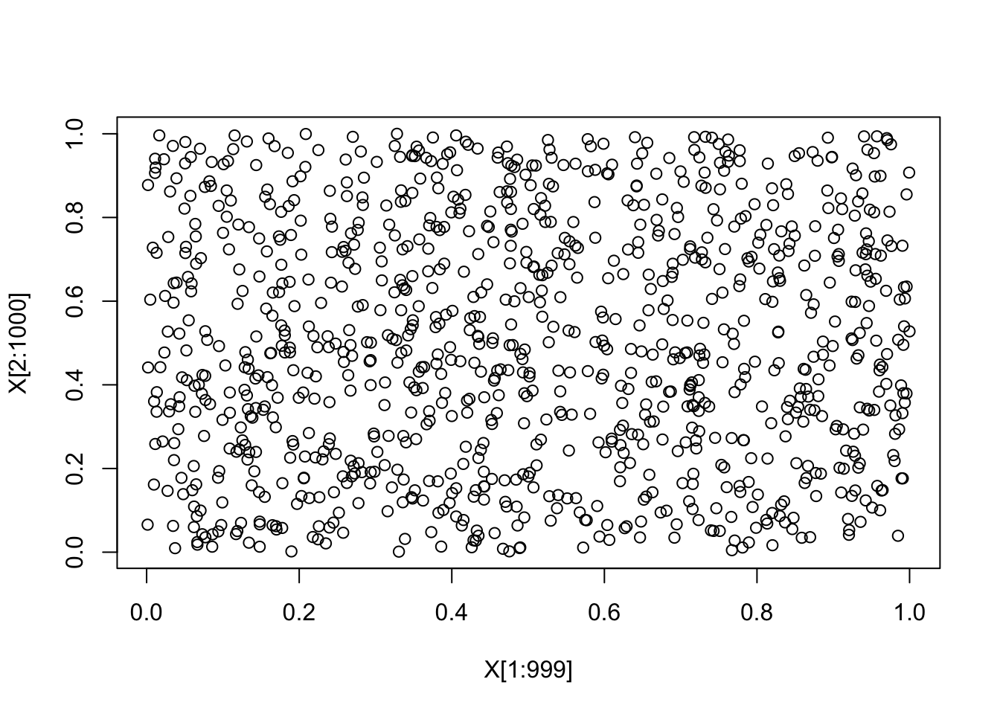
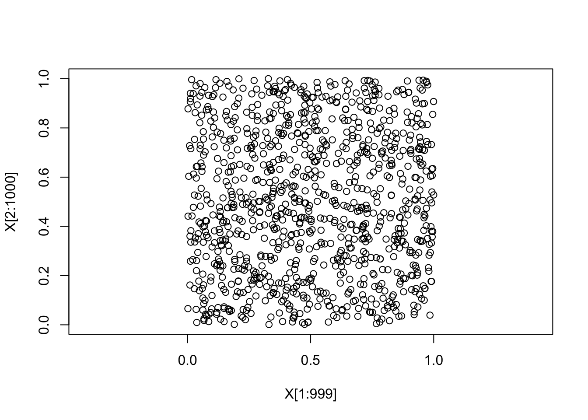
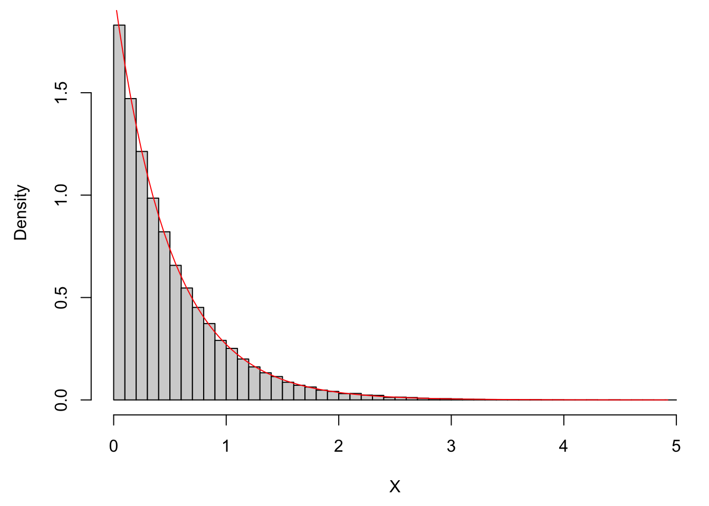

# Random number generation

## Pseudo random number generators

:::{.definition}

**PRNG**

A PRNG is an **algorithm** which outputs a sequence of numbers, which can be used as a **replacement** for an i.i.d. sequence of random numbers.

:::

### Structure of PRNG in computer

States: $s_0\xrightarrow{f} s_1 \xrightarrow{f} s_2 \xrightarrow{f} s_3 \xrightarrow{f} \dots$

Each state gives a random number :
$$s_1\xrightarrow{g}X_1\\
s_2\xrightarrow{g}X_2\\
s_3\xrightarrow{g}X_3\\
\vdots$$

where $s_i\in S.$ Here, $S$ is called the state space, $f:S\to S$ is called the mixing function and $g:S\to \mathcal R$ is called the output function.

Note that $s_0$ is never computed, $s_0$ is called the seed.


**Linear congruential generator (LCG)**

$mod \quad m$ means that we divide by m and take the remainder(對m取餘)

$X_n=a(X_{n-1}+c)\quad mod \quad m,$ where $X_n \in \{0,1,...,m-1\}, a\in \{1,2,...,m-1\}$, a is called the multiplier; $c\in \{0,1,...,m-1\}$, c is called the increment; $m\in \mathcal N=\{1,2,3,...\}$, m is called the modulus.

Under LCG, there's no difference between X and s. That is,
$X_n\in\{0,1,...,m-1\}:=S,\quad g(s)=s, \quad f(X)=(aX+c)\quad mod\quad m$

$X_0\in S$ is the seed in LCG.


:::{.example}

**LCG with $m=8, a=5, c=1, X_0=0$**

$X_1=(aX_0+c)\quad mod\quad m =(5\times 0+1)\quad mod\quad8=1$
$X_2=(aX_1+c)\quad mod\quad m =(5\times 1+1)\quad mod\quad8=6$
$X_3=(aX_2+c)\quad mod\quad m =(5\times 6+1)\quad mod\quad8=7$


```r
m <- 8
a <- 5
c <- 1
X0 <- 0


Xi <- X0
for (i in 1:10){
  Xi <- (a*Xi + c)%%m
  cat("X_", i, " = ", Xi, "\n", sep="")
}
```

```
## X_1 = 1
## X_2 = 6
## X_3 = 7
## X_4 = 4
## X_5 = 5
## X_6 = 2
## X_7 = 3
## X_8 = 0
## X_9 = 1
## X_10 = 6
```


```r
rLCG <- function(n, m, a, c, X0){
  Xi <- X0
  for (i in 1:n){
    Xi <- (a*Xi + c)%%m
    cat("X_", i, " = ", Xi, "\n", sep="")
  }
}

rLCG(5,8,5,1,0)
```

```
## X_1 = 1
## X_2 = 6
## X_3 = 7
## X_4 = 4
## X_5 = 5
```


```r
rLCG <- function(n, m, a, c, X0){
  result <- numeric(n)
  Xi <- X0
  for (i in 1:n){
    Xi <- (a*Xi + c)%%m
    result[i] <- Xi
  }
  return(result)
}

rLCG(5,8,5,1,0)
```

```
## [1] 1 6 7 4 5
```


```r
rLCG(16,8,5,1,0)
```

```
##  [1] 1 6 7 4 5 2 3 0 1 6 7 4 5 2 3 0
```

```r
# Did you notice that it just repeat itself?
# This will be discuss later with the quality of PRNG
# also notice m=8, so it repeats itself every 8 numbers
```


```r
X <- rLCG(5,8,5,1,0)

plot(X)
```


```r
# the defult breaks on integer, which is not good
X <- rLCG(100000, 8,5,1,0)
hist(X) 
```


```r
X <- rLCG(100000, 8,5,1,0)
hist(X, breaks = seq(-0.5, 7.5, 1)) 
```


```r
X <- rLCG(10, 8,5,1,0)
hist(X, breaks = seq(-0.5, 7.5, 1))
```


```r
rLCG(10, m=2^31, a=1103515245, c=12345, X0=0)
```

```
##  [1]      12345 1406932606  654583808 1358247936 2138638336 1459132416
##  [7] 1445521408  370866176 1896597568 1518859008
```

:::

LCG is outdated nowadays, the purpose of introducing this method is to give you a general understanding of how pseudo random numbers are produced in computer.


```r
# the normal way to choose seed
?set.seed
```


```r
set.seed(0)
runif(3)
```

```
## [1] 0.8966972 0.2655087 0.3721239
```

```r
set.seed(1)
runif(3)
```

```
## [1] 0.2655087 0.3721239 0.5728534
```

### Quality of PRNGs

There are a number of criteria.

1. Period Length

The computer has only finite memory, so we can't have infinite state space. It turns out that PRNG starts repeating itself after a while (entering the states that it has already visited).

The maximum period length is $|S|$.

For LCG, $S=\{0,1,...,m-1\} \implies |S|=m$

Note that random numbers never repeat, but pseudo random numbers DO!!
But fortunately, we can have extremely large period in R.

Good PRNG have large period.


2. Distribution of samples

Aim: generate uniformly distributed samples.$U(0,1)$

For LCG, $X_n \in \{0,1,...,m-1\}$, and we've seen from previous examples that LCG is indeed uniformly distributed from $\{0,1,...,m-1\}$, note that this is not $U(0,1)$ but at least it's uniformly distributed.

To get $U(0,1)$, use the transformation $U_n:=\frac{X_n+1}{m+1}\in (0,1)$ for large m.

You can use histogram or check whether the PRNG visits each state exactly once (which then produces every pseudo number once) within its maximum period length.

Better criterion: PRNG output passes statistical tests for uniform distribution w/o problems (check example 1.6 in the book)

3. Independence of samples

You can just plot $X_n$ and $X_{n-1}$ on x-axis and y-axis respectively.


```r
X <- rLCG(1000,8,5,1,0)
# m=8 which means small state space, you won't expect this small m gives you uniformly distributed plot

plot(X[1:999], X[2:1000])
```


```r
X <- rLCG(1000, m=2^32, a=1103515245, c=12345, X0=0)

plot(X[1:999], X[2:1000])
```



```r
# well, it now looks like uniformly distributed
```


```r
U <- (X+1)/(2^32+1)
range(U)
```

```
## [1] 2.874527e-06 9.979539e-01
```

```r
round(range(U),4)
```

```
## [1] 0.000 0.998
```


```r
plot(U[1:999], U[2:1000], asp=1)
```



```r
# Great, U(0,1)
```


```r
par(mai=c(0.9,0.9,0.1,0.1))
plot(U[1:999], U[2:1000], asp=1)
```


```r
# Use R's default PRNG: Mersenne-Twister

X <- runif(1000)
plot(X[1:999], X[2:1000])
```




```r
plot(X[1:999], X[2:1000], asp=1)
```



```r
# You can see there's no discernible pattern
```


In fact, the states are not independent, each state is completely determined by previous state via the function f, you can check the algorithm again. So the states are definitely not independent. But what about those outputs $X_1,X_2,...$ produced by the function g? Well, then you need to choose g properly such that g will lose some information from the states and thus make those outputs $X_1,X_2,...$ independent.

So theoretically, they are not independent unless you can choose g cleverly. 

From our scatter plots above, they actually look quite good.

:::{.definition}

**k-dimensionally equi-distributed**

A sequence of numbers is said to be k-dimensionally equidistributed if every k-tuple of possible outputs occurs equally often in this sequence.

:::

For example, consider LCG with k=2, we need to consider all pairs: (1,1), (1,2), (1,3),...

They are 2 dimensionally equi-distributed if the frequency of all possible pairs converge to the same number.

k-dimensionally equi-distributed is what we would expect for a sequence of independent random numbers.

Good PRNG has this property for large k.

4. Role of the seed

Seed will determine which of the possible output sequences of PRNG we will get.


```r
set.seed(1) # always get the same output
```

- Reproducible output(for reports or debugging)

- For non-reproducible output: use techniques like current time of day as the seed.

## The inverse transform method

Aim: Convert $U\sim U(0,1)$ into X from a given distribution on $\mathcal R$

:::{.definition}

The cumulative distribution function (cdf) is given by $$F(a)=P(X \le a)$$

Moreover, $$P(X\in (a,b])=P(X \le b)-P(X\le a)=F(b)-F(a)$$

:::
 

:::{.proposition}


$$U \sim U(0,1), X:=F^{-1}(u)\\
\implies X \text{ has cdf } F$$

:::

:::{.proof}

$F^{-1}(u):=inf\{x\in \mathcal R|F(x)\ge u  \}$

Let $U\sim U(0,1), X=F^{-1}(u)$. Then

$$P(X \le a)=P(F^{-1}(u)\le a)\\
=P(inf\{x\in \mathcal R | F(x)\ge u\}\le a)\\
=P(F(a)\ge u)\\
=P(u\le F(a))\\
=\frac{F(a)-0}{1-0}\\
=F(a)$$

We use the facts that $inf\{x\in \mathcal R | F(x)\ge u\}\le a\iff F(a)\ge u$ and $U\sim U(0,1)$

:::

:::{.example}

Consider $X\sim Exp(\lambda)$

$f(x)=\begin{cases} \lambda e^{-\lambda x} & x\ge 0 \\ 0 & x<0 \end{cases}$

$\implies F(a)=P(X\le a)=\int_{-\infty}^{a}f(x)dx=\int_{0}^{a}\lambda e^{-\lambda x}dx\\=(-e^{-\lambda x})|_{x=0}^{a}=-e^{-\lambda a}-(-e^{-\lambda 0})=1-e^{-\lambda a}$

$u=F(x)=1-e^{-\lambda x}\\ \iff e^{-\lambda x}=1-u \iff -\lambda x=log(1-u)\iff x=-\frac{log(1-u)}{\lambda}$


```r
N <- 1e5
U <- runif(N)
lambda <- 2
X <- -log(1-U)/lambda
par(mai=c(0.9, 0.9, 0.1, 0.1))
hist(X, main=NULL, prob=TRUE, breaks=50)

x <- seq(0, max(X), length.out=100)

lines(x, dexp(x, lambda), col="red")
```



:::


## Rejection sampling

### Basic Rejection Sampling

