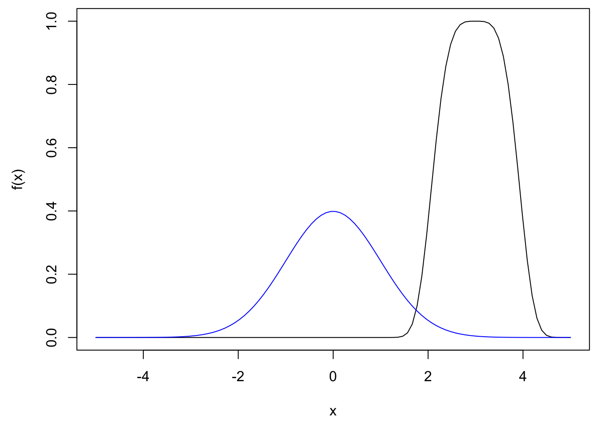
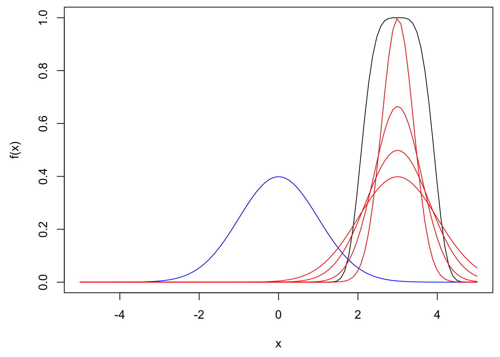
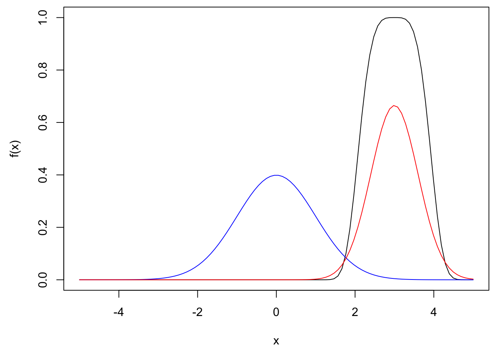

# Monte Carlo methods

## Studying models via simulation

Recall: 

:::{.definition}

In discrete case, expectation is defined to be 

$E(X)=\sum_x xP(X=x)$

$E(f(X))=\sum_x f(x)P(X=x)$

In continuous case, we have

$E(X)=\int_{\mathcal R}x\phi(x)dx$

$E(f(X))=\int_{\mathcal R}f(x)\phi(x)dx$ where $\phi(x)$ is the density of $X$ at $x$

:::

$\underline{\text{Law of Large Numbers (LLN)}}$

Let $(X_j)_{j\in \mathcal N}$ be a sequence of i.i.d. copies of $X$

Then $$\lim_{N\to \infty}\frac1N \sum_{j=1}^{N}f(X_j)=E[f(X)]$$


**Ideas for approximating $E[f(X)]$:**

1. Use $E(X)=\int x\phi(x)dx$ and try to numerically approximate the integral, this relates to numerical analysis and will not be covered here.

2. $E(f(X))=\lim_{N\to \infty}\frac1N \sum_{j=1}^{N}f(X_j) \approx \frac1N \sum_{j=1}^{N}f(X_j)$ for a large N

i.e., $Z^{MC}_N=\frac1N\sum_{j=1}^{N}f(X_j)$, where $X_j$, j=1,...,N are i.i.d. copies of $X$, then $Z^{MC}_N\approx E[f(X)]$

:::{.example}

Assume $X\sim N(\mu, \sigma^2)$, assume we want to estimate $E[sin(X)]$, i.e., $f(X)=sin(X),\quad Z^{MC}_N=\frac1N\sum_{j=1}^{N}sin(X_j),\quad X_1,...,X_N\sim i.i.d. N(\mu, \sigma^2)$


```r
# aim: estimate E(sin(X)) where X is normal

mu <- 1
sigma <- 1
N <- 1000000
X <- rnorm(N, mu, sigma)

mean(sin(X))
```

```
## [1] 0.5105143
```


:::


**Applications:**

1. computing probabilities

Recall a indicator function: $\boldsymbol 1_A(x)=\begin{cases}1 & \text{ if }x\in A\\ 0 & \text{ if }x\notin A\end{cases}$

$\implies E(\boldsymbol 1_A(x))=0\times P(\boldsymbol 1_A(x)=0)+1\times P(\boldsymbol 1_A(x)=1)=P(X\in A)\\ \implies P(X\in A)=E(\boldsymbol 1_A(x))=\frac1N\sum_{j=1}^{N}\boldsymbol 1_A(X_j)$, which is exactly the proportion of $X_j$ which are in A


```r
# aim: estimate P(X in A), where X is a random variable and A is a set.

# assume X ~ N(0,1)
# let A=[1, 2]

N <- 1e6
X <- rnorm(N)
f.of.X <- ifelse(X>=1 & X<=2, 1, 0)
mean(f.of.X)
```

```
## [1] 0.136378
```


```r
# In fact, we can get the exact result

pnorm(2)-pnorm(1)
```

```
## [1] 0.1359051
```


2. computing integrals

Assume we want to approximate $\int_{a}^{b}h(x)dx$

Choose $X\sim U(a,b)\implies \phi(x)=\begin{cases}\frac{1}{b-a} & \text{ if } x\in [a,b]\\0 & \text{ if } x\notin [a,b]\end{cases}$

$E(f(X))=\int f(x)\phi(x)dx=\int_a^b h(x)dx$

Also, $f(x)\phi(x)= f(x)\boldsymbol 1_{[a,b]}\frac{1}{b-a}=f(x)\frac{1}{b-a} \forall x \in [a,b] \implies f(x)=h(x)(b-a)$

So, if $X\sim U(a,b)$, then $\int_a^b h(x)dx=E((b-a)h(X))\approx \frac1N \sum_{j=1}^{N}(b-a)h(X_j)$, where $X_j\sim U(a,b)$ are i.i.d.


```r
# aim: integrate h(x)=x^2 from 2 to 3

N <- 1e6
X <- runif(N, 2, 3)
f.of.X <- X^2*(3-2)
mean(f.of.X)
```

```
## [1] 6.333822
```

Analytic solution:

$\int_{2}^{3}x^2dx=\frac13x^3|^{3}_{x=2}=\frac133^3-\frac132^3=\frac1327-\frac138=9-\frac83=\frac{19}{3}$


```r
19/3
```

```
## [1] 6.333333
```


## Monte Carlo estimates

### Computing Monte Carlo estimates

Recall: $Z_N^{MC}=\frac1N\sum_{j=1}^{N}f(X_j)\approx E(f(X))$, where $X_j$ are i.i.d. copies of $X$

- need to generate the $X_j$ (see chapter 1 in the book)

- need to apply $f$ to get $f(X_j)$

- need to compute the average, a lot of memory is needed to store $X_1,...,X_N$

To save memory, we could sum up the values, as we generate them:

```
s <- 0
for j=1,...,N:

  generate X_j
  
  s <- s + f(X_j)
 
```

result: $s/N$

The downside is that the `for loop` in R is relatively slow, so there's a trade-off. Use the `for loop` if you run out of memory.

We will also need to compute the sample variance of the $f(X_j):$

$s^2_{f(X_j)}=\frac{1}{N-1}\sum_{j=1}^{N}(f(X_j)-\bar{f(X)})^2=\frac{1}{N-1}\sum_{j=1}^{N}f(X_j)^2-\frac{N}{N-1}(\frac1N\sum_{j=1}^{N}f(X_j))^2$, where $\bar{f(X)}=\frac1N\sum_{j=1}^{N}f(X_j)$

```
s <- 0
t <- 0
for j=1,..,N:
  generate X_j
  s <- s + f(X_j)
  t <- t + (f(X_j))^2
```

Then $Z_N^{MC}=s/N, s^2=\frac{t}{N-1}-\frac{N}{N-1}(Z_N^{MC})^2$


### Monte Carlo error and Choice of sample size

Recall:

$Z_N^{MC}=\frac1N\sum_{j=1}^{N}f(X_j)\approx E(f(X))$

- $bias(Z_N^{MC})=E(Z_N^{MC})-E(f(X))$

- $std. error(Z_N^{MC})=std.dev(Z_N^{MC})=\sqrt{Var(Z_N^{MC})}$

- $MSE(Z_N^{MC})=E(Z_N^{MC}-E[f(X)]^2)=Var(Z_N^{MC})-bias(Z_N^{MC})^2$

- $E(Z_N^{MC})=E(\frac1N\sum_{j=1}^{N}f(X_j))=\frac1N\sum_{j=1}^{N} E(f(X_j))=\\ \frac1N\sum_{j=1}^{N} E(f(X))=\frac N N E(f(X))=E(f(X))$

In the above, we use the fact that $X_j$ are i.i.d copies of $X$

Hence, we get $bias(Z_N^{MC})=0$, and $MSE(Z_N^{MC})=Var(Z_N^{MC})=std. error(Z_N^{MC})^2$

- $Var(Z_N^{MC})=Var(\frac1N \sum_{j=1}^{N}f(X_j))\\=\frac{1}{N^2}\sum_{j=1}^{N}Var(f(X_j))=\frac{1}{N^2}\sum_{j=1}^{N}Var(f(X))=\frac1N Var(f(X))$

Hence, we get $MSE(Z_N^{MC})=Var(Z_N^{MC})=\frac1N Var(f(X))$

- $RMSE(Z_N^{MC})=\sqrt{\frac{Var(f(X))}{N}}=\frac{std.error(Z_N^{MC})}{\sqrt{N}}$


To achieve $RMSE(Z_N^{MC})\le \epsilon$, we need $\epsilon\ge RMSE(Z_N^{MC})\\ \implies \epsilon^2\ge MSE(Z_N^{MC})=\frac1N Var(f(X))\\\implies N\ge \frac{Var(f(X))}{\epsilon^2}$

We can estimate $Var(f(X))$ from data, using the sample variance of the $f(X_j)$.

### Refined error bounds

$e_N^{MC}=Z_N^{MC}-E(f(X))$

Recall Law of Large Numbers (LLN), $$\lim_{N\to \infty}\frac1N\sum_{j=1}^{N}f(X_j)=E(f(X))\\ \implies \lim_{N\to \infty}Z_N^{MC}=E(f(X))\\ \implies \lim_{N\to \infty}e_N^{MC}=\lim_{N\to \infty}(Z_N^{MC}-E[f(X)])=0$$

Note that this is true even if $Var(f(X))=\infty$

Recall Central Limit Theorem (CLT),

$$\frac{\sqrt{N}e_N^{MC}}{\sigma}=\frac{\sqrt N}{\sigma}(Z_N^{MC}-E[f(X)])\\=
\frac{\sqrt N}{\sigma}(\frac1N \sum_{j=1}^{N}f(X_j)-\frac1N\sum_{j=1}^{N}E[f(X)])\\
=\frac{1}{\sqrt N}\sum_{j=1}^{N}\frac{f(X_j)-E[f(X)]}{\sigma}\to^d N(0,1)\text{ as } N\to \infty$$

where $\sigma=\sqrt{Var(f(X_j))}=\sqrt{Var(f(X))}$

So, for large N (approximately):

$$\frac{\sqrt N}{\sigma}e_N^{MC}\sim N(0,1)\\
\implies e_N^{MC}\sim N(0, \frac{\sigma^2}{N})=N(0, (\frac{\sigma}{\sqrt N})^2)$$

Hence, we can have:

$P(|e_N^{MC}|>1.96\frac{\sigma}{\sqrt N})= 5\%$ or

$P(E[f(X)]\in [Z_N^{MC}-1.96\frac{\sigma}{\sqrt N},Z_N^{MC}+1.96\frac{\sigma}{\sqrt N}])=95\%$


## Variance reduction methods

### Importance sampling(IS)

Recall: $Z^{MC}_N=\frac1N\sum_{j=1}^{N}f(X_j)\approx E(f(X))$, where $X_j$ are i.i.d. copies of $X$

Let $\phi$ be the density of $X$ and $\psi$ be the density of $Y$

$E(f(X))=\int f(x)\phi(x)dx=\int f(x)\frac{\phi(x)}{\psi(x)}\psi(x)dx=E(\frac{f(Y)\phi(Y)}{\psi(Y)})$

$Z_N^{IS}=\frac 1N \sum_{j=1}^{N}f(y_j)\frac{\phi(y_j)}{\psi(y_j)}$, where $Y_j$ are i.i.d. copies of $Y$

Recall: $MSE(Z_N)=Var(Z_N)+bias(Z_N)^2=Var(Z_N)$

We know $MSE(Z_N^{MC})=\frac{Var(f(X))}{N}$


$Var(Z_N^{IS})=Var(\frac 1N \sum_{j=1}^{N}\frac{f(Y_j)\phi(Y_j)}{\psi(Y_j)})=\frac{1}{N^2}\sum_{j=1}^{N}Var(\frac{f(Y_j)\phi(Y_j)}{\psi(Y_j)})$


(Note that:  

$E(\frac{f(Y_j)^2\phi(Y_j)^2}{\psi(Y_j)^2})=\int \frac{f(Y_j)^2\phi(Y_j)^2}{\psi(Y_j)^2}\psi(Y_j)dy=\int \frac{f(Y)^2\phi(Y)}{\psi(Y)}\phi(Y)dy=E(\frac{f(X)^2\phi(X)}{\psi(X)})$ and

$E(\frac{f(Y)\phi(Y)}{\psi(Y)})^2=E(f(X))^2$

thus, we have $Var(\frac{f(Y_j)\phi(Y_j)}{\psi(Y_j)})=E(f(X)^2\frac{\phi(X)}{\psi(X)})-E(f(X))^2\\=E(f(X)^2)-E(f(X))^2-E(f(X)^2)+E(f(X)^2\frac{\phi(X)}{\psi(X)})\\=Var(f(X))-E(f(X)^2(1-\frac{\phi(X)}{\psi(X)}))$


)

So, we get $Var(Z_N^{IS})=\frac{1}{N^2}\sum_{j=1}^{N}Var(\frac{f(Y_j)\phi(Y_j)}{\psi(Y_j)})=\frac 1N[Var(f(X))-E(f(X)^2(1-\frac{\phi(X)}{\psi(X)}))]$

In sum, 

$MSE(Z_N^{MC})=\frac 1N Var(f(X))$

$MSE(Z_N^{IS})=\frac 1NVar(f(Y)\frac{\phi(Y)}{\psi(Y)})=\frac 1N Var(f(X))-\frac 1NE(f(X)^2(1-\frac{\phi(X)}{\psi(X)}))$

If $\frac 1NE(f(X)^2(1-\frac{\phi(X)}{\psi(X)}))$ is positive, then the importance sampling estimates is better. The question now is which $Y$ should we choose to make this term positive.

To do this, we want to make $\psi$ large, but note that $\psi$ is the density of $Y$, i.e., $\int \psi(x)dx=1$. Thus, when somewhere gets larger, somewhere else must get smaller, so now the real question is where should we make $\psi$ large (That's why we call it Importance sampling)

Observing the term $E(f(X)^2(1-\frac{\phi(X)}{\psi(X)}))$. It turns out that we **make $\psi$ large where $f(X)^2$ is large**.


```r
# aim: estimate E(exp(-(X-3)^4)) where X ~ N(0,1)
# using Importance Sampling

f <- function(x) exp(-(x-3)^4)

x <- seq(-5, 5, length.out= 100)
par(mai=c(0.9, 0.9, 0.1, 0.1)) # mai = margin in inches
plot(x, f(x), type="l")
lines(x, dnorm(x), col="blue")
```




```r
# step 1: standard Monte-Carlo estimation

N <- 1e6
X <- rnorm(N)
mean(f(X))
```

```
## [1] 0.02102443
```

```r
RMSE.MC <- sqrt(var(f(X))/N)
RMSE.MC
```

```
## [1] 0.0001168939
```


```r
# step 2: Importance Sampling estimate

x <- seq(-5, 5, length.out= 100)
par(mai=c(0.9, 0.9, 0.1, 0.1)) # mai = margin in inches
plot(x, f(x), type="l")
lines(x, dnorm(x), col="blue")

lines(x, dnorm(x, 3), col="red")
lines(x, dnorm(x, 3, 0.8), col="red")
lines(x, dnorm(x, 3, 0.6), col="red")
lines(x, dnorm(x, 3, 0.4), col="red")
```




```r
# step 2: Importance Sampling estimate
# we have to choose Y
# here, we use Y ~ N(3, 0.6^2)

x <- seq(-5, 5, length.out= 100)
par(mai=c(0.9, 0.9, 0.1, 0.1)) # mai = margin in inches
plot(x, f(x), type="l")
lines(x, dnorm(x), col="blue")


lines(x, dnorm(x, 3, 0.6), col="red")
```



```r
Y <- rnorm(N, 3, 0.6)
phi <- function(x) dnorm(x)
psi <- function(x) dnorm(x, 3, 0.6)
mean(f(Y)*phi(Y)/ psi(Y))
```

```
## [1] 0.02110457
```

```r
RMSE.IS <- sqrt( var(f(Y) * phi(Y) / psi(Y)) / N)
RMSE.IS
```

```
## [1] 3.110853e-05
```

```r
RMSE.MC/RMSE.IS
```

```
## [1] 3.757617
```


### Antithetic variables

### Control variates
